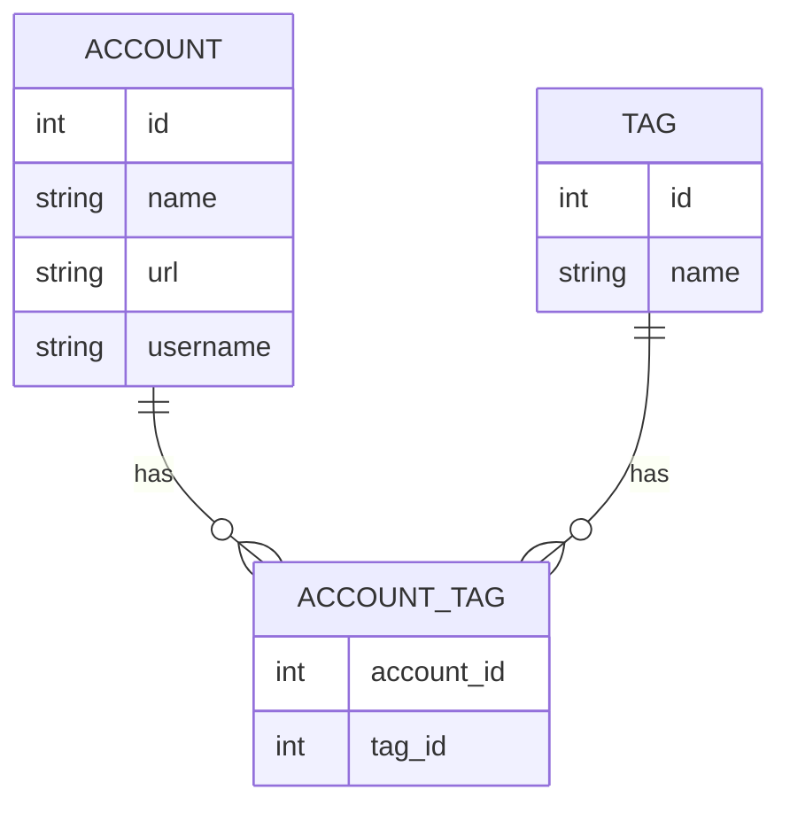

```mermaid
erDiagram

ACCOUNT {
  int id
  string name
  string url
  string username
}

TAG {
  int id
  string name
}

ACCOUNT_TAG {
  int account_id
  int tag_id
}

ACCOUNT ||--o{ ACCOUNT_TAG: has
TAG ||--o{ ACCOUNT_TAG: has
```
